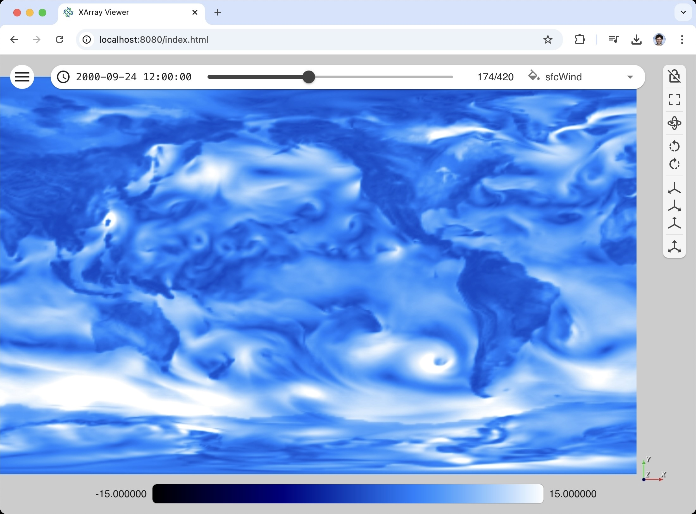

# Pan3D

[![Documentation Status][docs-image]][docs-link]
[![Binder][binder-image]][binder-link]
[![Build Status][GHAction-image]][GHAction-link]
[![PyPI Version][pypi-v-image]][pypi-v-link]
[![License][apache-license-image]][license-link]

Pan3D aims to be an utility package for viewing and processing a wide variety of multidimensional datasets. Any dataset that can be interpreted with [xarray][xarray-link] can be explored and rendered with Pan3D. [Read The Doc][docs-link] is available for additional information.

XArray Viewer is a Pan3D application focused on geospatial rendering use cases. This is a graphical user interface leveraging the Pan3D infrastructure to help geospatial scientists explore data.

For an introduction to this project, check out our [blog post][blog-post-link].

## Installation

To install requirements for the Pan3D VTK mesh builder class only:

    pip install pan3d

To install requirements for the graphical user interface (viewers + explorers):

    pip install "pan3d[viewer]"

**Optional**: to install requirements for Pangeo and ESGF catalogs, respectively:

    pip install "pan3d[pangeo]"

    pip install "pan3d[esgf]"

**Recommended**: To install all requirements, including optional packages:

    pip install "pan3d[all]"

## Quick Start

`xr-viewer` is the main entrypoint for launching XArray Viewer locally. Below are some example usages.

To launch XArray Viewer without a target dataset to browse XArray examples:

    xr-viewer

To launch XArray Viewer with a local path to a target dataset:

    xr-viewer --xarray-file ./examples/example_dataset.nc

To launch XArray Viewer with a remote URL to a target dataset:

    xr-viewer --xarray-url https://host.org/link/to/dataset.zarr

To launch XArray Viewer with a compatible configuration file (see [examples][examples-link]):

    xr-viewer --import-state ./examples/example_config_xarray.json

To launch the Catalog browser will allow you to query the Pangeo and ESGF Dataset Catalogs (see [Catalogs Tutorial](tutorials/catalogs.md)) depending on the available dependencies:

    xr-catalog

You may have to install the required dependencies:

    pip install "pan3d[pangeo]"
    pip install "pan3d[esgf]"

> The `xr-viewer` entrypoint will automatically launch your default browser to open `localhost:8080`.
>
> To launch without opening your browser, add the `--server` argument to your command.

## Tutorials

- [How to use XArray Viewer](tutorials/dataset_viewer.md)
- [XArray Viewer command line](tutorials/command_line.md)
- [Catalogs Tutorial](tutorials/catalogs.md)
- [How to use Pan3D in a Jupyter notebook](tutorials/jupyter_notebook.md)

## Examples

Pan3D comes with a set of example configuration files and example Jupyter notebooks in the [examples][examples-link] folder. You can checkout the repository to run these locally, or you can use the [Pan3D Binder instance][binder-link] to run these examples.

<!-- Links -->
[docs-image]: https://readthedocs.org/projects/pan3d/badge/?version=latest
[docs-link]: https://pan3d.readthedocs.io/en/latest
[binder-image]: https://mybinder.org/badge_logo.svg
[binder-link]: https://mybinder.org/v2/gh/Kitware/pan3d/main?labpath=examples%2Fjupyter
[GHAction-image]: https://github.com/Kitware/pan3d/workflows/Test/badge.svg
[GHAction-link]: https://github.com/Kitware/pan3d/actions?query=event%3Apush+branch%3Amain
[pypi-v-image]: https://img.shields.io/pypi/v/pan3d.svg
[pypi-v-link]: https://pypi.org/project/pan3d/
[apache-license-image]: https://img.shields.io/badge/license-Apache%202-blue.svg
[license-link]: https://raw.githubusercontent.com/Kitware/pan3d/main/LICENSE
[xarray-link]: https://docs.xarray.dev/en/stable/user-guide/io.html
[blog-post-link]: https://www.kitware.com/kitware-introduces-pan3d-a-collaborative-interoperable-visualization-tool/
[examples-link]: https://github.com/Kitware/pan3d/tree/main/examples
