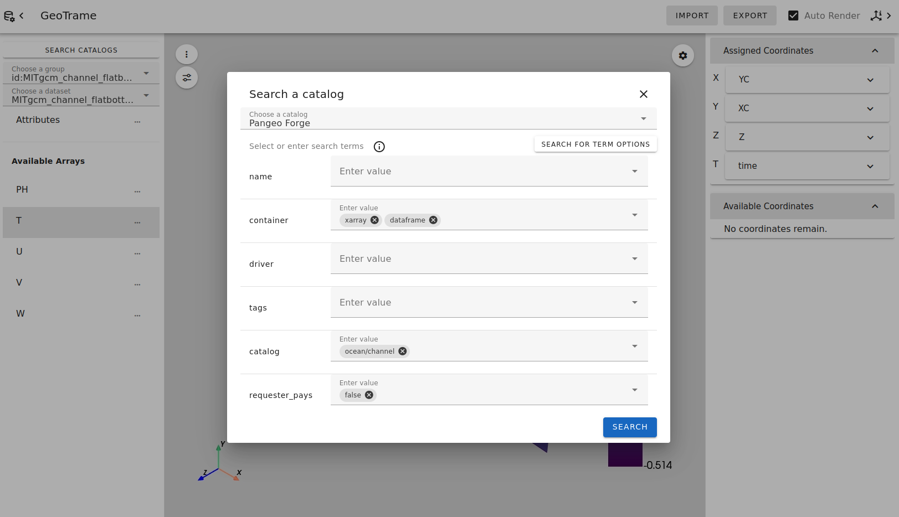
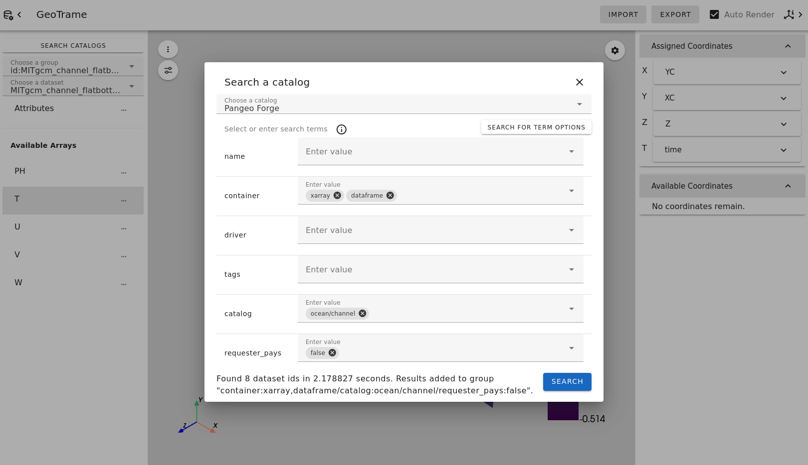
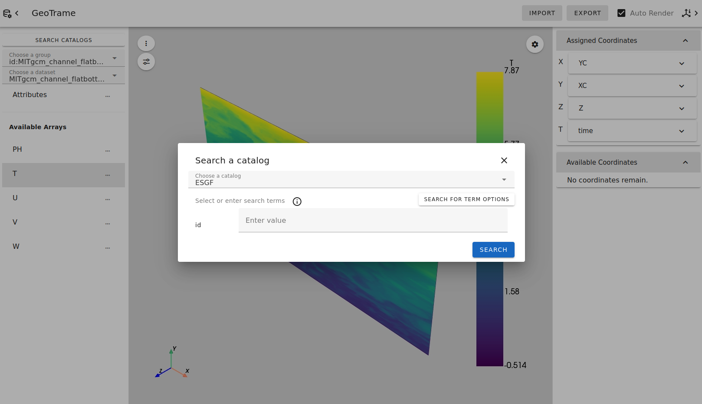
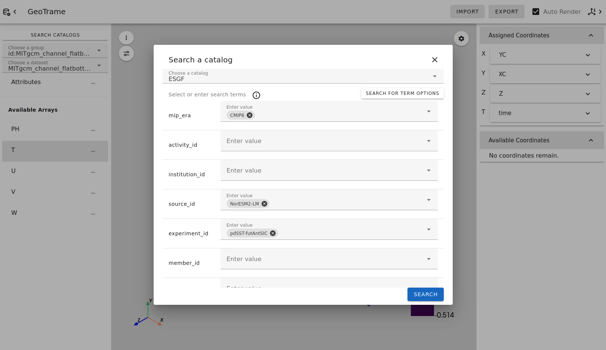
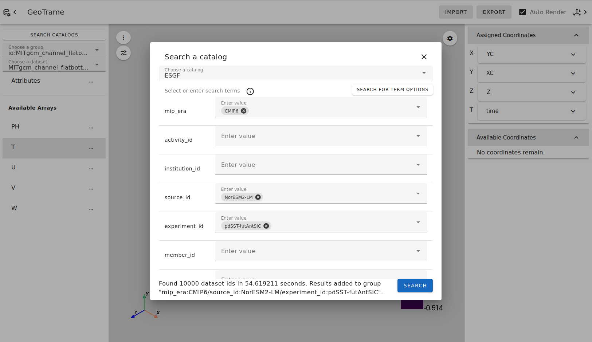
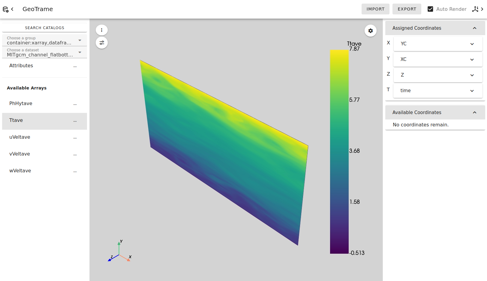

# Catalog Search Tutorial

## Introduction

Pan3D includes catalog modules to explore two existing third-party dataset repositories: the Pangeo datastore and the **E**arth **S**ystem **G**rid **F**ederation (ESGF) 2 datastore. The [Pangeo Catalog][pangeo-info] uses the Python package `intake` ([docs][pangeo-intake]) and the [ESGF Catalog][esgf-info] uses the Python package `intake-esgf` ([docs][esgf-intake]).

After installing the necessary requirements and specifying that the application should be launched with these catalogs enabled, GeoTrame includes a dialog in the user interface to perform attribute-based filtering on the datasets available in each datastore. After performing a filter search, the returned set of datasets will be grouped and made available in the sidebar, at which point you can select any dataset in the group to explore.

This tutorial will provide a walkthrough of the Catalog Search dialog.

## Get started

To follow along this tutorial, install GeoTrame and Catalog dependencies:

    pip install pan3d[geotrame,pangeo,esgf]  # Equivalent to pan3d[all]

Run GeoTrame as a local python server with the following command.

    geotrame --catalogs pangeo esgf

GeoTrame will open as a tab in your default browser. You can also visit `localhost:8080` in another browser.

 > **Note:** to prevent the behavior of opening a tab on startup, add `--server` to the above command to run server mode.

## Using the Catalog Search Dialog
GeoTrame will start with no target dataset selected. An additional button with the text "Search Catalogs" will be visible in the sidebar. Clicking this button will open the Catalog Search Dialog. By default, the Pangeo Catalog is selected, so we'll explore this catalog first.

At this point, we have not queried the catalog, so there are no known attribute options to select. If you already know the unique identifier of a target dataset, you can type the value into the "id" field. For example, try pasting "MITgcm_channel_flatbottom_02km_run01_phys_snap15D" into the field, and click the "Search" button. After a moment to complete the search, a success message will be displayed:

Now you may exit the Catalog Search Dialog and find the new option in the Groups selection dropdown in the sidebar. Select the new group. The Dataset selection dropdown below now contains one entry, which is the target dataset we searched for. If you select this dataset, GeoTrame will load and render this data.

You can now explore this dataset like any other with GeoTrame. Try selecting the temperature array labeled "T".

This is the most basic usage of the Catalog Search Dialog. However, it is more common that the unique ID of a target dataset is unknown. You may wish to explore many datasets that have certain attributes. Let's examine this use case.

Return to the Catalog Search Dialog. We can perform an attribute search across the whole datastore to find all unique attribute options. Click on the button that says "Search For Term Options" to perform this search. Once the search is complete, there are several inputs for various attributes that exist on datasets in the datastore. Click on each input to see the list of available unique values for each attribute. You may select any number of these values for any number of attributes.

 > **Note:** Many of the datasets available in the Pangeo Catalog have a "requester pays" policy. These datasets are stored in Google Cloud, and the Pangeo project would like to avoid egress charges when users access the data. More information can be found [here][pangeo-requester-pays]. For the Pangeo Catalog, it is highly recommended that you filter for datasets that have `requester_pays=False`, as shown in the screenshot above. Any datasets with `requester_pays=True` will not load without further configuration to specify payment.

After performing the search, another success message will be displayed. This particular search returned 8 results and added them to a new group. You can select the new group to explore these 8 datasets.

Now we will switch to the ESGF catalog to perform more searches. Use the selection box at the top of the Catalog Search Dialog to select "ESGF". After switching catalogs, the search form will change. We have not yet searched for unique attributes in the ESGF Catalog, so the form only includes the default "id" field.

Click on the "Search for Term Options" button once more to perform an attribute search across the whole datastore. The ESGF Catalog is considerably larger, so this search will take longer (approximately 30 seconds). Once the search is complete, the search form will be populated with many attribute fields, each one with a list of value options. Select any number of values for your next search.

> **Note:** Unlike the Pangeo Catalog, all ESGF datasets are free to access, so there is no "requester_pays" attribute for this catalog.

After performing a search with the filtering shown above, a success message is displayed. This search is quite broad and encompasses many datasets. For performance reasons, the maximum number of results in a group is capped at 10,000. In these cases, you may need to refine a search further by selecting more attribute values.

You can perform as many searches as you like and each will result in the creation of a new dataset group if there are more than 0 matches. When you are done creating groups, exit the Catalog Search Dialog. You may explore the various new groups and the datasets in each group.

This concludes the tutorial for the Catalog Search Dialog.

<!-- Links -->
[pangeo-info]: https://catalog.pangeo.io/
[pangeo-intake]: https://gallery.pangeo.io/repos/pangeo-data/pangeo-tutorial-gallery/intake.html
[pangeo-requester-pays]: https://github.com/pangeo-data/pangeo-datastore/tree/master#accessing-requester-pays-data
[esgf-info]: https://nvcl.energy.gov/activity/earth-system-grid-federation-2
[esgf-intake]: https://intake-esgf.readthedocs.io/en/latest/index.html
