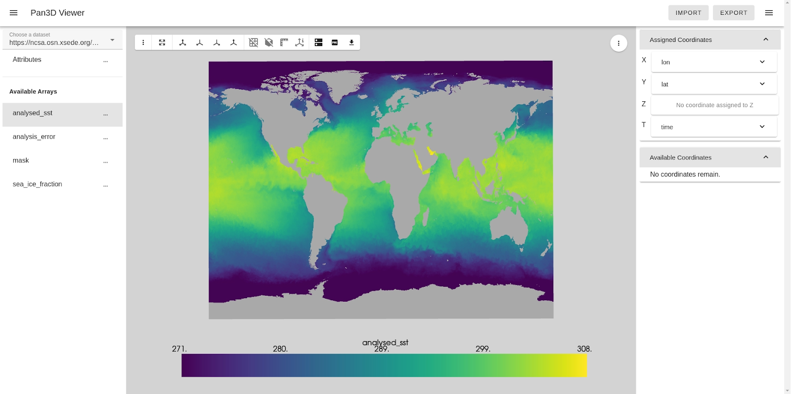
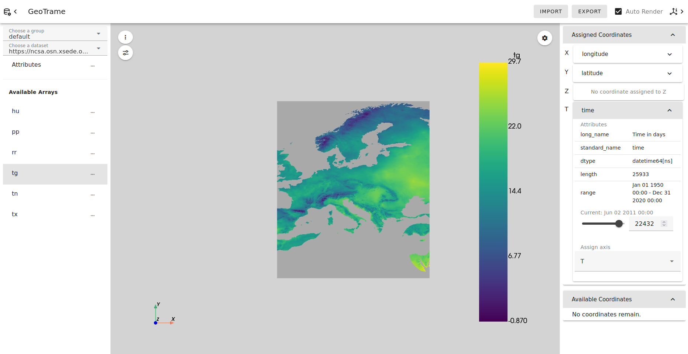
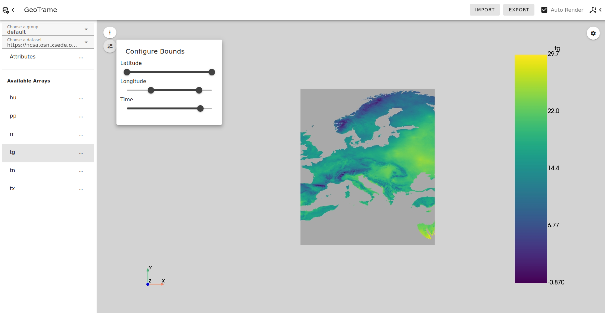
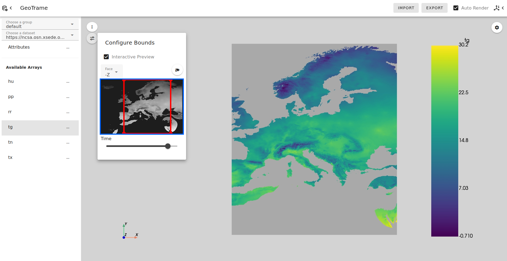
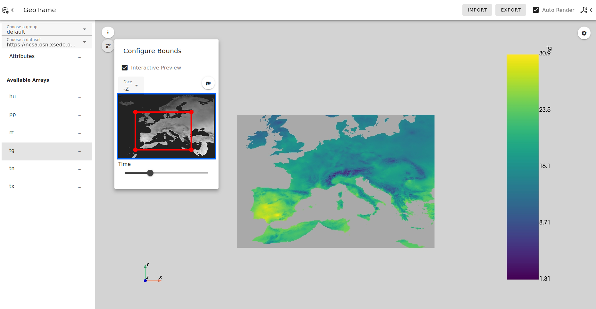
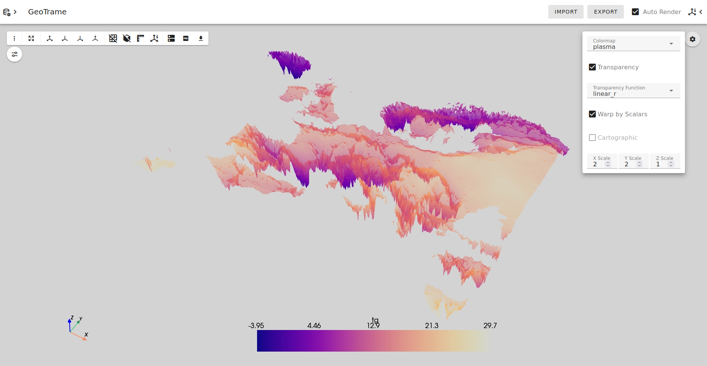

# GeoTrame Tutorial

## Introduction

Pan3D aids data scientists in exploring multidimensional datasets. For this tutorial, we will refer to a public multidimensional dataset provided by Pangeo Forge. This dataset was collected by the Copernicus Climate Change Service (C3S) as part of the **E**urope **OBS**ervational (E-OBS) gridded dataset. It contains observational data for precipitation, temperature, humidity, and air pressure.

For more information about this dataset, visit [the C3S Catalog](https://surfobs.climate.copernicus.eu/surfobs.php).

## Get started

To follow along this tutorial, install Pan3D with GeoTrame enabled.

```
pip install pan3d[geotrame]
```

Run GeoTrame as a local python server with the following command.

```
geotrame --dataset=https://ncsa.osn.xsede.org/Pangeo/pangeo-forge/pangeo-forge/EOBS-feedstock/eobs-tg-tn-tx-rr-hu-pp.zarr
```

GeoTrame will open as a tab in your default browser. You can also visit `localhost:8080` in another browser.

 > **Note:** to prevent the behavior of opening a tab on startup, add `--server` to the above command to run server mode.

 > **Note:** This tutorial also specifies a default render resolution of 2048 for higher quality images. You may specify a render resolution by adding `--resolution=[value]` to the above command. A higher resolution value will result in longer rendering times. If not specified, a default render resolution of 128 will be used for faster renders.

## Using the GeoTrame Viewer

#### Data selection

After a moment to load the data from the remote URL, GeoTrame will render the default configuration of the target dataset. This dataset contains daily weather data recorded over the European continent between years 1950 and 2020. When the dataset first loads, GeoTrame displays the first array ("hu") at the first time step (01-January-1950).


You can open the left drawer by clicking on the dataset configuration icon in the top left.


Inside this panel, you will find the following information:

- A group selection box. Its current value is "default". The only dataset in the default group is the one we passed as an argument. There is one more available group option in this selection box: the "xarray" group contains example Xarray datasets to explore. More groups can be added with the Catalog Search (See the [Catalog Search tutorial](catalogs.md) for details).
- A dataset selection box. This selection box contains all the datasets available in the currently selected group. Its current value is the url we passed as an argument, which is the only dataset available in the default group.
- A button to view the attributes of the current dataset. Click the three-dots icon next to "Attributes" to open a dialog table of metadata available on the dataset.

    

- A list of arrays available in the dataset, each with a button to view its attributes. The arrays in this dataset are abbreviations, so we can open the attributes tables to see the standard names. The first array ("hu") is mean relative humidity, and we can see the unit is percentage.

    

You can select any array from this list by clicking on the name. For this tutorial, we will continue with the the mean temperature data in the array called "tg". After a moment to load the new array, the rendering will update.

#### Data configuration

After selecting the "tg" array on the EOBS dataset, we will open the axis drawer on the right for further data configuration. To toggle the visibility of this drawer, click on the axis info icon in the top right corner. The axis configuration drawer allows us to change the default axis assignments and slicing.

By default, "longitude" is assigned to X, "latitude" is assigned to Y, and "time" is assigned to T. This data does not have a Z coordinate, so our rendered meshes are all planes. We will explore a dataset with a Z axis later.


We can expand any of these coordinate panels. When we expand longitude, we see the following information:

- The attributes table of the coordinate. For longitude, the units are degrees east, and there are 705 values ranging from -25 to 45.

- Inputs to adjust the slicing along the coordinate. For longitude, the default slicing starts at index 0, ends at index 705 (exclusive), and has a step of 1. When using the default render resolution of 128, the step will be 6. The step input is disabled when slicing is determined automatically from the `resolution` argument. Set the `resolution` value less than or equal to 1 to adjust the slice value for each coordinate manually.

- A selection box to assign the coordinate to an axis. These coordinates have already been assigned to each axis automatically, so longitude is assigned to the X axis.


> **Note:** Each time you change a value in this panel, GeoTrame will attempt to rerender. If you plan on making many changes before you want to rerender, disable the Auto Render feature with the checkbox in the top right. If Auto Render is disabled, a button will appear when you have made changes that have not been applied. You can click this button to trigger the rerender once you have made all changes. The button displays the total size of the data that will be loaded for the render.

> 

We can crop the rendered mesh and reduce its resolution by adjusting the slicing along these coordinates. After setting the start index to 200 and setting the stop index to 600, we get the following rendering.


Next, let's adjust another coordinate. Collapse the longitude panel and open the time panel. Instead of slicing options, a coordinate assigned to T will show a slider for selecting one time step to display.

Note that the time coordinate has 25933 slices. GeoTrame will only load the data for the current time step, so we don't load data that we don't need to render. This means that for each time change, GeoTrame will fetch more data, but each fetch will be much faster than trying to load the whole dataset at once.

GeoTrame displays the first time step (index 0) by default, which corresponds to January 01 1950. We can see from the attributes table that the time coordinate range begins with this time and ends with December 31 2020.



You can pick any index along this slider, and the label above will display the corresponding time step. Below, we have gone forward to June 02 2011, and Europe appears much warmer.



Data bounds may also be adjusted with the bounds configuration menu in the top left corner of the rendering area. Click the button with the sliders icon to toggle the visibility of this menu. We can close the axis drawer for now.

The bounds configuration menu displays range sliders for each coordinate. These show the changes we made to longitude and time. Try adjusting these sliders and observe how the rendered data changes.



When "Interactive Preview" is enabled, a greyscale preview of one face of the data will appear, replacing two of the spatial coordinate sliders. By default, the preview image is of the -Z face, so it replaces the sliders for X and Y.



We can now adjust the bounds of the X and Y coordinates by manipulating the red box within the preview image. We can still use the time slider, and updating the time value will trigger an update of the preview image.



The bounds configuration menu offers more features for 3D renders when three coordinates are assigned to X, Y, and Z. We'll revisit this panel with another dataset after this.

#### Render configuration

Let's reset the bounds and close the data selection drawer to focus on the rendering area. There are many options to customize the appearance of the rendering within this space.

1. We can move the camera around the rendered mesh by clicking and dragging. We can pan the camera by holding Shift while dragging, and we can roll the camera by holding Ctrl while dragging. We can move the camera toward the mesh and away from it by scrolling. We can see this mesh is a plane. We'll look at a 3D dataset soon.

2. The color legend is also interactive. We can drag it to another edge of the scene, or we can resize it by using the white bounding bars that appear when we click on the legend.

    

3. The button with the three-dots icon in the top left opens a Views menu. Beside the three-dots icon, there are 12 buttons for you to try.

    

    This menu contains the following options:

    1. A button to reset the camera position and re-center the mesh.
    2. A button to set the camera in a perspective view.
    3. A button to put the camera on the X axis (our plane will be invisible from this view).
    4. A button to put the camera on the Y axis (our plane will be invisible from this view).
    5. A button to put the camera on the Z axis (this is the default view for our plane).
    6. A button to toggle edge visibility (with our current high resolution, there are a lot of edges. Try zooming in when you enable this).
    7. A button to toggle bounding box visibility (this will draw a thin border around our plane when enabled).
    8. A button to toggle ruler visibility (these will show our latitude and longitude scales).
    9. A button to toggle an axis widget's visibility (this will appear in the bottom left. Try rotating the scene while this is enabled).
    10. A button to toggle between local and remote rendering mode. Local rendering is the default and is recommended for basic use cases.
    11. A button to save the current visual as a static PNG file.
    12. A button to save the current rendering as an interactive HTML scene.

4. The button with the gear icon in the top right opens a rendering customization menu. This menu contains five customization options.

    

    1. A colormap selection box. The default is "viridis". These options come from Matplotlib.
    2. A checkbox to enable transparency. When enabled, another selection box will appear with options for transparency function. The default is "linear".
    3. A checkbox to enable scalar warping. When enabled, scalar warping turns the rendered flat plane into a 3D mesh, where values are extruded in the Z axis according to their magnitudes.
    4. A checkbox to enable cartographic mode. When enabled, cartographic mode displays the data projected onto an earth sphere. This works best for data with latitude and longitude coordinates.
    5. Inputs to specify the relative scales of each axis. By default, this is a 1:1:1 ratio.

> **Note:** Scalar warping and cartographic mode are mutually exclusive.

Since we have data with latitude and longitude, enable cartographic mode to see the data on a globe.


By using the other configuration options, we can get a rendering like the one shown below. For the following rendering, we do the following:

- move the color legend
- change the colormap to "plasma"
- enable transparency and change the transparency function to "linear_r" (which means reverse linear)
- disable cartographic mode
- enable scalar warping
- change the axis scale ratio to 2:2:1 so the scalar warping will be less extreme
- reset the camera to perspective view



Take a moment to try out different combinations to see how else this data can be configured to appear.

#### Saving configurations

GeoTrame is intended to allow scientists to explore a dataset and find ideal visualizations with these many configuration options. Once you have found a visualization you like, you can use the PNG and HTML export options in the Views menu, but you can also export this configuration for fast replication with GeoTrame or the Pan3D DatasetBuilder.

After we finish our configuration and have a finalized rendering, we can click the "Export" button in the top toolbar. Clicking this button will open a dialog, which asks for a location to save a configuration file.


Some browsers, like Chrome, will allow specification of a download folder when you click on this input. Other browsers, like Firefox, do not allow this feature and will save the file to your default Downloads folder. By default, this file will be called `pan3d_state.json`. In browsers where you can specify download location, you can also change this name.

Once you have specified a download location, a file will be saved to your computer and the dialog will change.


For our configuration, the contents of the exported file appear as follows:

```
{
    "data_origin": "https://ncsa.osn.xsede.org/Pangeo/pangeo-forge/pangeo-forge/EOBS-feedstock/eobs-tg-tn-tx-rr-hu-pp.zarr",
    "data_array": {
        "name": "tg",
        "x": "longitude",
        "y": "latitude",
        "t": "time",
        "t_index": 22432
    },
    "data_slices": {
        "time": [0, 25932, 1],
        "latitude": [0, 464, 1],
        "longitude": [0, 704, 1]
    },
    "ui": {
        "main_drawer": false,
        "axis_drawer": false,
        "unapplied_changes": false,
        "error_message": null,
        "more_info_link": null,
        "expanded_coordinates": [],
    },
    "render": {
        "auto": true,
        "x_scale": 2,
        "y_scale": 2,
        "z_scale": 1,
        "scalar_warp": true,
        "cartographic": false,
        "transparency": true,
        "transparency_function": "linear_r",
        "colormap": "plasma"
    }
}
```

To learn more about the schema to which this configuration file adheres, visit the [Configuration Files documentation](../api/configuration.md).

Now, a collaborator can easily replicate our rendering. Try to save the JSON contents above to a file on your computer and follow along as if you just received this file from a colleague.

Clicking the "Import" button in the top toolbar will open a similar dialog. Click the file input to select the location of the configuration file on your computer.


Once the file has been selected, another "Import" button will appear. After clicking this button, the dialog will change and GeoTrame will begin loading the configuration and applying the changes.


After a moment to load, GeoTrame will render the replicated scene.

These configuration files can be used as arguments in the local server startup command (see [Command Line instructions](command_line.md) for details) or can be used in a Jupyter notebook environment (see [Jupyter Notebook tutorial](jupyter_notebook.md) for details).

#### Viewing other data

Open the left drawer again and select "xarray" in the Group selection box. The current dataset will be cleared and the Dataset selection box will be populated with seven example datasets from Xarray. You can look at any of these examples from Xarray and try out the configuration options we have reviewed.

There is one dataset among these with 4D data, which means we can select a time slice and get a 3D render. Select "Xarray Examples - ERA-Interim analysis" to experiment with GeoTrame features on a 3D mesh. We'll use the array labeled "v", which represents wind velocity in m/s.


As mentioned previously, there is a feature in the bounds configuration menu that is only available for data that has coordinates assigned to X, Y, and Z. More options will be available in the face selection dropdown.


More specifically, the -Z and +Z faces are available when coordinates are assigned to X and Y, and the preview for Z faces will replace the X and Y range sliders. The -Y and +Y faces are available when coordinates are assigned to X and Z, and the previews will replace the X and Z sliders. The -X and +X faces are available when coordinates are assigned to Y and Z, and the previews will replace the Y and Z sliders.


We are viewing the -Z face by default, so the X and Y sliders are replaced by the preview image. We can adjust the bounds of X and Y with the red box just like before. Since we also have a coordinate assigned to Z on this dataset, the Z slider is still available.


Changing the Z bounds will affect what is shown in the preview image; changing the start value will trigger a change in the +Z face preview, and changing the stop value will trigger a change in the -Z face preview. This is indicated by a blue handle on the Z slider.


You can change the face used for the preview image with the selection box above the preview. If we select +Z, the other handle on the level slider becomes blue.

To orient the selected face towards you, you can click the camera location button next to the face selection box.


Selecting faces along other axes will change which sliders are visible. Try viewing the preview for other faces, orienting the selected face toward you with the camera button, and adjusting bounds with the red box and sliders.


This concludes the tutorial on how to use GeoTrame. Now you can try these features on your own data, or use [Catalogs](catalogs.md) to explore more public data.

<!-- Links -->
[xarray-tutorials-link]: https://docs.xarray.dev/en/stable/generated/xarray.tutorial.open_dataset.html
