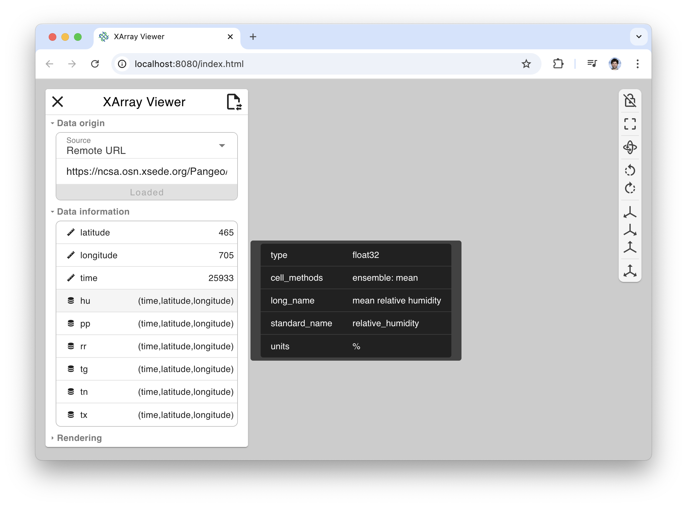

# Pan3D XArray Viewer Tutorial

## Introduction

Pan3D aids data scientists in exploring multidimensional datasets. For this
tutorial, we will refer to a public multidimensional dataset provided by Pangeo
Forge. This dataset was collected by the Copernicus Climate Change Service (C3S)
as part of the **E**urope **OBS**ervational (E-OBS) gridded dataset. It contains
observational data for precipitation, temperature, humidity, and air pressure.

For more information about this dataset, visit
[the C3S Catalog](https://surfobs.climate.copernicus.eu/surfobs.php).

## Get started

To follow along this tutorial, install Pan3D with its viewer enabled.

```
pip install pan3d[viewer]
```

Run XArray Viewer as a local python server with the following command.

```
xr-viewer --xarray-url https://ncsa.osn.xsede.org/Pangeo/pangeo-forge/pangeo-forge/EOBS-feedstock/eobs-tg-tn-tx-rr-hu-pp.zarr
```

Pan3D XArray Viewer will open as a tab in your default browser. You can also
visit `localhost:8080` in another browser.

> **Note:** to prevent the behavior of opening a tab on startup, add `--server`
> to the above command to run server mode.

## Using the XArray Viewer

#### Data selection

After a moment to load the data from the remote URL, **xr-viewer** will provide
the data information of the target dataset. This dataset contains daily weather
data recorded over the European continent between years 1950 and 2020. When the
dataset first loads, xr-viewer list all the data available within the dataset
without downloading anything more than its metadata.


Inside the left panel, you will find the following information:

**Data Origin**

The **Data Origin** group gather information on where the data is located. So
far we've started from a URL so both the source (Remote URL) and its id (actual
URL) are captured to which allow the application to provide a state for
reproducibility.

But you can pick other sources or ids. For `Local File` and `Remote URL`, a text
field is provided as ID so you can enter the path or URL that you aim to load.
If you select the `XArray Tutorial` option, you will get a drop down of the
dataset names availables from the tutorial.

At the bottom of that section a **Load** button is available to trigger the
fetch of the XArray Dataset attributes. Once click, the **Data Information**
section will automatically expend and will be filled by the various arrays
available for that given dataset.

**Data Information**

When overlaying your mouse on the various arrays listed, additional information
are provided like shown below.



The one highlighted in the screenshot above is "hu", which is mean relative
humidity, and we can see the unit is percentage.

The next section is for configuring the **rendering**.

**Rendering**

By filling the rendering section and clicking on "Update 3D view", you will
actually trigger data download from the XArray source to produce a VTK data
structure that will then be render in 3D.

The picture below illustrate what this section contains when no input have been
provided.


You can select several arrays to load and therefore enable into your VTK mesh.
For this tutorial, we will continue with the the mean temperature data in the
array called "tg".

By selecting "tg" in the `Data arrays` drop down, the first selected will be
chosen for you for the `Color By` drop down. But you are free to change it if
you have loaded more than one array.

When the `Color By` get changed, the provided array is getting fetch for
extracting its range and reporting it in the UI for further tuning if need be.

If you are satisfied with the default color preset, axis cropping (default no
crop), axis steps and representation scaling, you can click on the "Update 3D
view" button, to fully generate the mesh and render it in the screen.

After a moment to load the new array, the rendering will update.


#### Data Navigation

Once you are done with the **data selection**, you can close the left panel (X
button on the top left). At that point you will be presented with a more
streamlined interface.


The top toolbar spell out the current time (1984-97-17 00:00:00) while providing
a convenient slider to navigate through time. On the right of it, you can select
any available array to change the color mapping.

On the right side, you see the 3D View toolbar that is always present. That
toolbar is composed of the following set of actions:

- Toggle interaction lock: this allow to prevent any involontary camera
  manipulation by locking the 3D view.
- Reset Camera: this will reposition the camera to make the data fully fit in
  the 3D view.
- Toggle interaction mode: this allow to toggle between 3D rotation and 2D
  panning.
- Rotate left: this allow to roll the camera 90º on the left.
- Rotate right: this allow to roll the camera 90º on the right.
- Reset camera normal to X axis.
- Reset camera normal to Y axis.
- Reset camera normal to Z axis.
- Reset camera at an angle.

At the bottom, you have an interactive Scalar Bar that show the scalar range but
also can give you the scalar value of a given color. Just hover your mouse on it
to see the corresponding selected value. The picture below illustrate what you
can expect.


#### Advanced Data selection

Sometime, you don't want to download the full dataset domain and it might be
better to only fetch a subset of longitude and latitude.

For instance, with the dataset loaded, we can adjust the longitude.

Based on the metadata, we know that the units are degrees east, and there are
705 values ranging from -25 to 45.


To adjust the slicing along the coordinate. For longitude, the default slicing
starts at index 0, ends at index 705 (exclusive), and has a step of 1.


> **Note:** Each time you change a value in this panel, xr-viewer will attempt
> to rerender.

We can crop the rendered mesh and reduce its resolution by adjusting the slicing
along these coordinates. After setting the start index to 200 and setting the
stop index to 600, we get the following rendering.


On top of that cropping, we can also adjust the stepping to load even less data.
In the picture below we are actually extracting 1/10 values across each axis.


#### Saving configurations

XArray Viewer is intended to allow scientists to explore a dataset and find the
actual subset that is relevant for further exploration or analysis. For that
reason, you can save a configuration file that can then be reused when loading
the data for another visualization tool like the Pan3D explorers or any PyVista
based visualization.

To access the **Export** feature, you need to have the left panel open and click
on the "Import/Export" icon like shown in the screenshot below.


By clicking on the `Export state file`, a file will be downloaded with the
`xarray-state.json` name.

For our configuration, the contents of the exported file appear as follows:

```
{
  "data_origin": {
    "source": "url",
    "id": "https://ncsa.osn.xsede.org/Pangeo/pangeo-forge/pangeo-forge/EOBS-feedstock/eobs-tg-tn-tx-rr-hu-pp.zarr",
    "order": "C"
  },
  "dataset_config": {
    "x": "longitude",
    "y": "latitude",
    "z": null,
    "t": "time",
    "slices": {
      "time": 8644,
      "longitude": [
        199,
        600,
        10
      ],
      "latitude": [
        0,
        465,
        10
      ]
    },
    "t_index": 8644,
    "arrays": [
      "tg"
    ]
  },
  "preview": {
    "view_3d": true,
    "color_by": "tg",
    "color_preset": "Cool to Warm",
    "color_min": -3.1199999302625656,
    "color_max": 33.85999924317002,
    "scale_x": 1,
    "scale_y": 1,
    "scale_z": 1
  },
  "camera": {
    "position": [
      10.24986034998275,
      48.249860539223604,
      162.88522596047304
    ],
    "view_up": [
      0.0,
      1.0,
      0.0
    ],
    "focal_point": [
      10.24986034998275,
      48.249860539223604,
      0.0
    ],
    "parallel_projection": 0,
    "parallel_scale": 42.15779864439795
  }
}
```

To learn more about the schema to which this configuration file adheres, visit
the [Configuration Files documentation](../api/configuration.md).

Now, a collaborator can easily replicate our rendering. Try to save the JSON
contents above to a file on your computer and follow along as if you just
received this file from a colleague.

Clicking the "Import state file" menu item will restore the state of the data
and application.

These configuration files can be used as arguments in the local server startup
command (see [Command Line instructions](command_line.md) for details) or can be
used in a Jupyter notebook environment (see
[Jupyter Notebook tutorial](jupyter_notebook.md) for details).

#### Viewing other data

Open the left panel again and select "XArray Tutorial" in the Data Origin Group
selection box. The current dataset will be cleared and the Dataset selection box
will be populated with seven example datasets from the XArray Tutorial. You can
look at any of these examples from Xarray and try out the configuration options
we have reviewed.

There is one dataset among these with 4D data, which means we can select a time
slice and get a 3D render. Select "eraint_uvz" to experiment with the viewer
features on a 3D mesh. We'll use the array labeled "v", which represents wind
velocity in m/s.


No that we have a 3D dataset, we can use the slicing tool rather than the
cropping one. To activate it, just click on the crop/slice icon on the right of
the sliders to toggle across each mode.

On the pictures below, we are slicing along the Z axis.

|  |  |  |
| ------------------------------- | ------------------------------- | ------------------------------- |

This concludes the tutorial on how to use xr-viewer. Now you can try these
features on your own data.

<!-- Links -->

[xarray-tutorials-link]:
  https://docs.xarray.dev/en/stable/generated/xarray.tutorial.open_dataset.html
