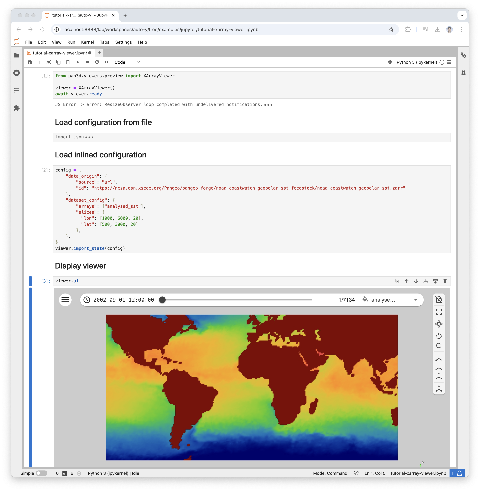

# How to use Pan3D and XArray Viewer in a Jupyter Notebook

Running Pan3D in a Jupyter notebook allows data scientists to incorporate the tool into their existing workflows and can facilitate greater collaboration between teammates. This tutorial assumes you have a running Jupyter notebook. You can find examples at [notebook examples][notebook-examples-link] in the Pan3D code repository. You can run these examples on Binder [here][binder-link].

1. In your current kernel, install Pan3D:

        pip install pan3d[all]

2. In the first cell of your notebook, initialize Pan3D’s XArray Viewer.

        from pan3d.viewers.preview import XArrayViewer

        viewer = XArrayViewer()
        await viewer.ready

3. Prepare a configuration for the builder to import. This can come from a previously exported Pan3D configuration file. An example of this is shown in [`example_config_xarray.json`][config-xarray-link]:

        import json
        from pathlib import Path

        config = Path("../example_config_xarray.json")
        if config.exists():
            viewer.import_state(json.loads(config.read_text()))
            print("State loaded")
        else:
            print(f"Could not find example state in {config.resolve()}")

4. You can alternatively create a configuration dictionary. See [`url_config.ipynb`][url-config-notebook-link] for an example of this:

        config = {
            "data_origin": {
                "source": "url",
                "id": "https://ncsa.osn.xsede.org/Pangeo/pangeo-forge/noaa-coastwatch-geopolar-sst-feedstock/noaa-coastwatch-geopolar-sst.zarr"
            },
            "dataset_config": {
                "arrays": ["analysed_sst"],
                "slices": {
                  "lon": [1000, 6000, 20],
                  "lat": [500, 3000, 20]
                },
            },
        }

        viewer.import_state(config)

5. Finally to display the visualization in Jupyter, you can run the following cell

        viewer.ui

6. You can even share the visualization in PyVista as well by running the following cell assuming you've installed PyVista in your Python environment.

        import pyvista as pv

        plotter = pv.Plotter()
        plotter.show()
        
        xarray_reader = viewer.source
        actor = plotter.add_mesh(xarray_reader, scalars="analysed_sst", cmap='coolwarm')

        # sync viewer update
        viewer.ctrl.view_update.add(plotter.render)

While in the example we are using an XArrayViewer to drive our dataset builder, we can create such data source outside of the viewer and rely on it to drive any kind of visualization.

[notebook-examples-link]: https://github.com/Kitware/pan3d/tree/main/examples/jupyter
[binder-link]: https://mybinder.org/v2/gh/Kitware/pan3d/main?labpath=examples%2Fjupyter
[config-xarray-link]: https://github.com/Kitware/pan3d/blob/main/examples/example_config_xarray.json
[url-config-notebook-link]: https://github.com/Kitware/pan3d/blob/main/examples/jupyter/url_config.ipynb
